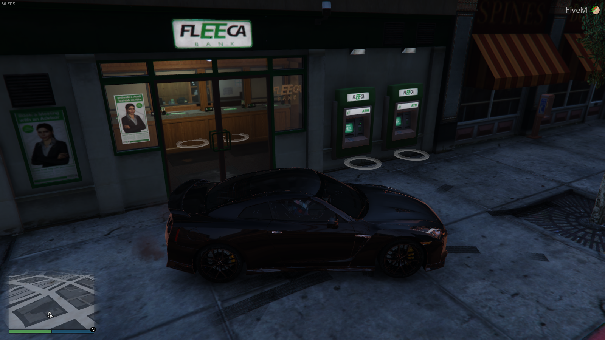

# REE Money

REE Money intends to be an entire banking platform for custom plugins
that want to use REE. It also provides over 100 in-game ATMs and banks that 
players can interact with. The example below shows you how to build a simple
soda shop using **ree-money**. 

> #### Requirements
> The following FiveM plugins are also required:
> * async
> * mysql-async
> * NativeUILua-Reloaded
> * ree-core
> * ree-map

## Features

### Important Features
* :sparkles: **Usable ATMs and Banks throughout San Andreas**
* :sparkles: Balances Always Synced
* :sparkles: Hot Reloading (mostly) Works
* :zap: Highly Optimized (keep your 60+ fps!)
* :zap: Automatically Create Player Accounts
* :lock: Designed with security in mind
* :pencil: Automatic transaction logging

### Still Needs Work :building_construction:
* [ ] Support for ATM withdraw and deposit limits
* [ ] General bug squashing

## In-Game Banks & ATMs

There are around individual 100 ATM locations available for use
in San Andreas with **ree-money**, and bank locations that players
can enter. When you walk up to a bank or ATM, you will see markers showing
where the player can stand and press <kbd>E</kbd> to activate the menu.




## How To Use

### Purchase an Item

Purchasing an item can only be done server-side. This is intentionally so
player cannot manipulate their balances. This example will show you how
to create a client that starts a transaction, how the server processes it,
and how it calls back to the client to handle the result.

**example/shared.lua** (used by both server and 
```lua
RegisterNetEvent("example:buySoda")
function PurchaseItem(price)
    -- purchase the item
    TriggerServerEvent("example:buySoda", price) -- $2 soda
end
```

**example/client.lua**
```lua
-- do something that triggers a purchase
PurchaseItem(2)

RegisterNetEvent("example:giveSoda")
AddEventHandler("example:giveSoda", function()
    -- give your player a soda!
end)

RegisterNetEvent("example:_displayMessage")
AddEventHandler("example:_displayMessage", function(errMsg)
    -- display a message to the player
    Citizen.Trace("Purchase failed: " .. errMsg)
end)
```

**example/server.lua**
```lua
REE = nil

TriggerEvent("ree:getInstance", function(_REE) REE = _REE end)
while REE == nil do Citizen.Wait(25) end

RegisterNetEvent("example:buySoda")
AddEventHandler("example:buySoda", function(amount)
    -- copy the source so we don't lose it
    local serverID = source
    local player = REE.Lib.Users.GetPlayerByServerID(serverID)
    
    if player == nil then
        error("Couldn't purchase soda -- failed to find REE player")
    end
    
    -- purchase the item, and give it a callback
    TriggerServerEvent("ree-money:purchaseItem", player.id, amount, 
        "Purchased a $"..amount.." soda from Sarah's Sodas",
        function(success, errMsg)
            if success then
                -- purchase complete, give them their soda!
                TriggerClientEvent("example:giveSoda", serverID)
            else 
                -- pass back the error to the client
                TriggerClientEvent("example:_displayMessage", errMsg)
            end
        end)
 end)
```

## Events

These are the available events for **ree-money**. 

**Client Events:**
```
ree-money:getBalance(func cb(table{1, 2, 3} balances))
ree-money:setBalance(table{1, 2, 3} balances)
ree-money:transferSuccess(string msg)
ree-money:displayOverlay()
```

**Server Events:** 
```
ree-money:getBalance()      -- NET
ree-money:purchaseItem(number player_id, number amount, string desc, 
                       func callback(success, errMsg))
ree-money:transfer(number from_account, number to_account, 
                   number amount, string reason)
```


## License
